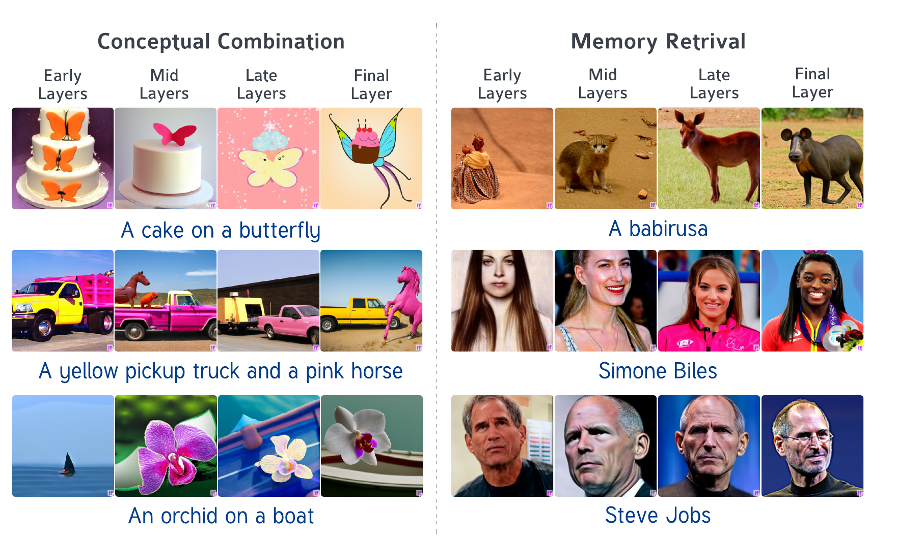

# DiffusionLens: Interpreting Text Encoders in Text-to-Image Pipelines



## Abstract

Text-to-image diffusion models (T2I) use a latent representation of a text prompt to guide the image generation process. However, the encoder that produces the text representation is largely unexplored. We propose the **DIFFUSION LENS**, a method or analyzing the text encoder of T2I models by generating images from its intermediate representations. Using the DIFFUSION LENS, we perform an extensive analysis of two recent T2I models. We find that the text encoder gradually builds prompt representations across multiple scenarios. Complex scenes describing multiple objects are composed progressively and more slowly than simple scenes; earlier layers encode the concepts in the prompts without a clear interaction, which emerges only in later layers. Moreover, the retrieval of uncommon concepts requires further computation until a faithful representation of the prompt is achieved. Concepts are built from coarse to fine, with details being added until the very late layers. Overall, our findings provide valuable insights into the text encoder component in T2I pipelines.


## Installation

```
conda create --name diffusionlens --file requirements_2024.txt
conda activate diffusionlens
```

## How to run Diffusion Lens

1. Donwload diffusers v0.20.2 from: https://github.com/huggingface/diffusers to this folder (You can download a zip file from the repository - make sure to choose the v0.20.2 tag)
2. change the name of the library to diffusers_local
3. replace the file 'pipeline_stable_diffusion' in diffusers_local/src/diffusers/pipelines/stable_diffusion/pipeline_stable_diffusion.py with the file in this repository
4. If you would like to use IF (Deep Floyd) model: replace 'pipeline_if' in diffusers_local/src/diffusers/pipelines/deepfloyd_if/pipeline_if.py' with the file in this repository
5. Run Diffusion Lens on a list of prompts from a file:
```
python -u run_experiment.py --model_key v1 --img_num 4 --generate  --step_layer 4 --folder_name <output_dir> --input_filename <prompt_file>
```
step_layer: the number of layers to skip between each generated image (default is 4)
input_filename: the name of the file with the prompts (default is prompts.txt)
img_num: int: number of seeds to generate for each prompt and intermediate representaion
model_key: str: name of the model to apply Diffusion Lens on. Can be either "v1" for Deep Floyd or "sd2.1" for Stable Diffusion 2.1.

Note: The input file with the prompts should be in the inputs folder.

## Common Issues
If you get the following error:
```
AssertionError: Torch not compiled with CUDA enabled
```
Make sure you have installed pytorch with CUDA support. You can check it by running:
```
python -c 'import torch; print(torch.cuda.is_available())'
```
If you get False, you need to install pytorch with CUDA support. You can find the installation instructions here: https://pytorch.org/


## Images Generated with the Diffusion Lens

Images generated using the Diffusion Lens for our experiments will be uploaded soon
